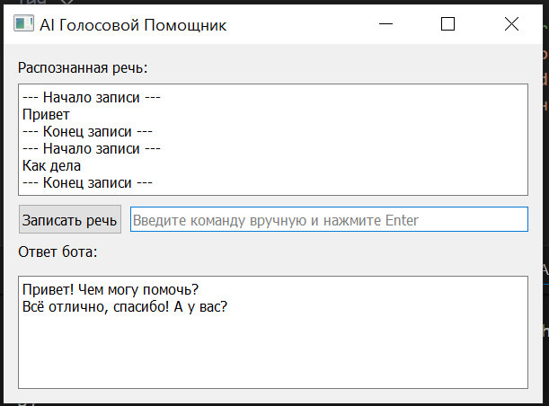

# AI Голосовой Помощник (Python)

Простой голосовой ассистент с распознаванием речи и синтезом голоса. Вы также можете реализовать свои функциональные команды для работы и реакции бота. 



Файлы:
- app.py — основное приложение на PyQt5
- requirements.txt — зависимости

Установка (Windows):
1. Рекомендуется создать виртуальное окружение:

```powershell
python -m venv venv
venv\Scripts\activate
```

2. Установите зависимости:

```powershell
pip install -r requirements.txt
```

Примечание по PyAudio (Windows): установка PyAudio может требовать скачивания колеса (.whl) с сайта https://www.lfd.uci.edu/~gohlke/pythonlibs/ и установки через `pip install PyAudio‑<version>.whl`.

Альтернатива на Windows (проще): установить `pipwin`, который автоматически найдёт и установит совместимый wheel:

```powershell
pip install pipwin
pipwin install pyaudio
```

Запуск:

```powershell
python app.py
```

Использование:
- Нажмите кнопку "Записать речь" и говорите — распознанный текст появится в поле, а бот ответит голосом.
- Можно вводить команды вручную в поле ввода и нажать Enter.

Поддерживаемые простые команды (пример):
- "привет" — приветствие
- "время" — показать текущее время
- "дата" — показать сегодняшнюю дату
- "что ты умеешь" — краткое описание возможностей

Если нужно, добавлю поддержку непрерывного прослушивания, интеграцию с более точными ASR/ TTS сервисами или команды для управления системой.